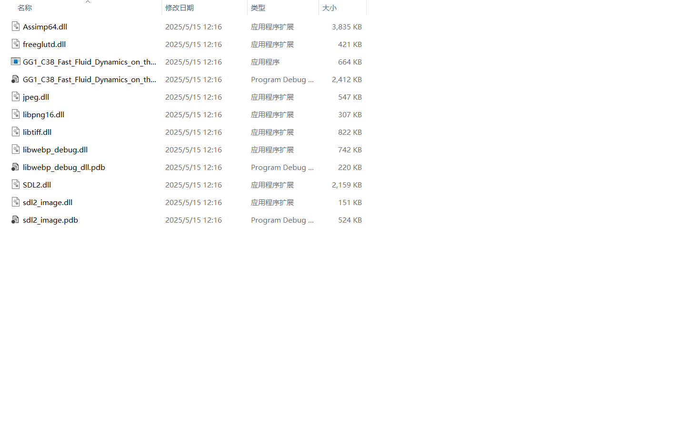

# GG1-C38-Fast-Fluid-Dynamics-on-the-GPU-VS2022
[GG1-C38-Fast-Fluid-Dynamics-on-the-GPU](https://github.com/OpenGL-GPU-Gems-Implementations/GG1-C38-Fast-Fluid-Dynamics-on-the-GPU?tab=readme-ov-file) An implementation version on visual studio 2022

The x64/debug folder is as follows. If there are missing files, you need to manually copy the corresponding files from the nuget package to the debug folder.